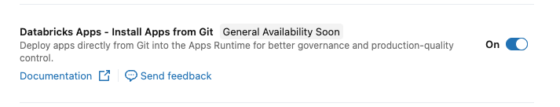
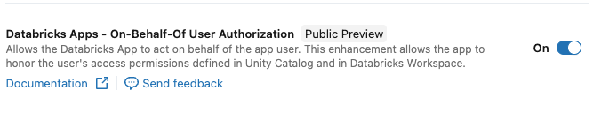

developed by Databricks MVP - Maksim Pachkouski:

[](https://medium.com/@protmaks) &nbsp;
[](https://linkedin.com/in/protmaks) &nbsp;
[](https://github.com/protmaks) &nbsp;

# Databricks Apps — Streamlit Modular Template

[Article with description](https://medium.com/towards-data-engineering/databricks-apps-tutorial-scalable-streamlit-modular-template-for-production-83af8143520a)

A starter template for building modular Streamlit applications, deployable as a [Databricks App](https://docs.databricks.com/en/dev-tools/databricks-apps/index.html).

It splits a Streamlit project into a tiny, flat structure instead of one large `app.py`:

- **`app.py`** — entry point: page configuration and navigation only.
- **`pages/`** — one file per page; each page is a self-contained script.
- **`assets/`** — static files: logos.

Use this as a clean starting point and add your own pages.

## Run this fork directly from Git

This fork includes **all 42 Python runtime packages** in `vendor/wheels/`, including
Streamlit's frontend assets and the native NumPy, pandas, Pillow, and PyArrow
libraries. They are ordinary Git files, so a normal clone includes them without
Git LFS, submodules, package registries, or an installation step.

The bundle targets **CPython 3.11 on Linux x86-64 with glibc 2.28 or newer**
(including Ubuntu 22.04 and the default Databricks Apps runtime). Python and the
operating system must already be present. These native wheels are specific to
that runtime; Windows, macOS, ARM, Alpine Linux, and other Python versions need a
different bundle.

```bash
git clone https://github.com/pi-squared/databricks_apps_streamlit_mod_template.git
cd databricks_apps_streamlit_mod_template
python3.11 run.py
```

Open `http://localhost:8501`. Use `python3.11 run.py --server.port 9000` to change
the local port. On Databricks, `app.yaml` runs the same launcher with the platform's
`DATABRICKS_APP_PORT` and host configuration.

The launcher verifies every wheel's SHA-256 and unpacks a temporary cache on first
use. Later launches reuse that cache. It runs isolated Python, so dependencies
come from this checkout even if other versions are installed. It never invokes
pip, uv, or a download command. An empty, `--no-index` `requirements.txt` also
prevents Databricks' dependency build step from fetching packages.

Verify the dependency closure and native imports without starting the server:

```bash
python3.11 run.py --check
python3.11 -I -S tests/offline_smoke.py
python3.11 -I -S tests/offline_http_smoke.py
```

The package inventory, versions, hashes, and license paths are recorded in
`vendor/manifest.json`; see [THIRD_PARTY_NOTICES.md](THIRD_PARTY_NOTICES.md).
The bundle is about 109 MiB compressed and needs roughly 400 MiB of temporary
disk space when unpacked. Dependency downloads are unnecessary at runtime;
links and external badge images in this README still require internet access.

---

## Project structure

```
app.py                  # st.set_page_config + st.navigation
app.yaml                # Databricks App run command
run.py                  # Isolated, offline launcher
requirements.txt        # Empty dependency list; prohibits registry access
requirements.in         # Direct dependencies for maintainers
requirements.lock       # Full closure with hashes; optional offline pip input
vendor/
  manifest.json         # Package inventory and SHA-256 checksums
  wheels/               # Complete, checked-in dependency archives
pages/
  home.py               # Renders this README
  example.py            # Hello-world page split into 2 tabs
  example_tabs/
    greeting.py         # def render()  — text input tab
    counter.py          # def render()  — session_state tab
  product.py            # Two-column layout
  form.py               # st.form with submit button
assets/
  logo.png, logo_sm.svg
```

Each page in `pages/` is independent — it loads its own data, renders its own widgets. Modularity here means **one page = one file**: easy to find, easy to delete, easy to copy as a starting point for a new page.

### Adding a new page

1. Create `pages/my_page.py`. Inside, write a regular Streamlit script (`st.header`, widgets, etc.).
2. Register it in `app.py` inside the `menu` dict:
   ```python
   "My section": [
       st.Page("pages/my_page.py", title="My page", icon=":material/star:"),
   ],
   ```

### Splitting one page into tabs across multiple files

When a page grows, you can split it into tabs where each tab lives in its own file. See [pages/example.py](pages/example.py) — it delegates each tab to a module in [pages/example_tabs/](pages/example_tabs/) via a `render()` function:

```python
tab_a, tab_b = st.tabs(["Greeting", "Counter"])

with tab_a:
    from pages.example_tabs.greeting import render as render_greeting
    render_greeting()

with tab_b:
    from pages.example_tabs.counter import render as render_counter
    render_counter()
```

Each tab module is a plain Python file with one `render()` function — no top-level `st.*` calls, so the parent page controls layout. Imports are inside the `with tab:` block so unused tabs don't run their imports. Pass shared state (e.g. a loaded DataFrame) as arguments: `render(df)`.

### When pages start to share code

If two pages need the same loader or widget, extract it. The simplest path: a single `shared.py` in the project root. Only introduce a `components/` package once you have several modules to put in it.

---

## Local development

1. Run the app with the bundled dependencies:
   ```bash
   python3.11 run.py
   ```

2. (Optional) Create a `.env` file for any secrets your app needs. `python-dotenv` is loaded by `app.py`, so anything in `.env` becomes available via `os.environ`.

Edit `app.py` or a page and let Streamlit reload it. There is no virtual environment
or dependency installation required. Keep `.env` and secrets out of Git.

### Updating the bundle (maintainers only)

Keep the original direct requirements in `requirements.in`. For the current exact
versions, download the hash-locked wheels into a new, empty directory on Linux
x86-64 with Python 3.11 and glibc 2.28 or newer:

```bash
python3.11 -m pip download --no-index --find-links vendor/wheels \
  --only-binary=:all: --dest /tmp/template-wheels -r requirements.lock
```

That command reproduces the existing bundle entirely offline. To update versions,
resolve `requirements.in` with pip's `--only-binary=:all:` option and compatible
manylinux platform tags into an empty directory using PyPI, replace the wheel set,
then regenerate its inventory and rerun both checks above:

```bash
python3.11 scripts/describe_bundle.py
```

The generator does not download anything. Commit the wheels, inventory, lock,
and notices together when changing dependencies.

---

## Deployment as a Databricks App

### 1. Enable Git-backed deployments

Your administrator must enable Git-backed deployments in the Databricks workspace.

1. Go to **Settings** → **Workspace Settings**.
2. Navigate to the **Previews** section.
3. Enable the toggle for **Databricks Apps Git-backed deployments**.



### 2. Install App from Git

1. In the sidebar, navigate to **Compute** and select the **Apps** tab.
2. Click the **Create app** button in the top right corner.
3. In the creation dialog, select **Git repository** as the source.
4. Fill in the repository details:
   - **Git repo URL:** `https://github.com/pi-squared/databricks_apps_streamlit_mod_template.git`
   - **Git provider:** Select **GitHub**.
5. Click **Create**.
6. Click **Deploy** with settings:
   - **Branch:** Specify the branch to deploy (e.g., `main`).
   - **App source code path:** Leave empty if the code is in the root directory.

Databricks will automatically create a Service Principal for the app and begin the build process.

### 3. Grant Permissions

If the application needs to manage workspace resources (clusters, jobs), add the App's Service Principal to the Admin group.

1. Go to **Settings** → **Identity and access** → **Groups**.
2. Select the **admins** group.
3. Click **Add members**.
4. Search for your **App Name** (or its Service Principal ID) and add it.

> **Note:** Every Databricks App creates its own identity. Granting Admin rights gives the app full control over the workspace.

To allow the app to run under the identity of the logged-in user:

1. Go to **Settings** → **Workspace Settings**.
2. Navigate to the **Previews** section.
3. Enable the toggle for **User identity for Databricks Apps**.



### 4. Set Access Permissions

1. In the sidebar, click **Compute** → **Apps**.
2. Click on the application name.
3. Go to the **Permissions** tab and configure access.

### 5. Open the App

1. In the sidebar, click **Compute** → **Apps**.
2. Click on the application name.
3. Click **Deploy** and select the **main** branch.
4. Click **Open app** in the top right corner.

### 6. Daily Usage Note

> **Important:** Stop the application when not in use, or set up a scheduled job to stop it — otherwise it runs 24/7 and continuously consumes compute resources.

To stop: go to the **Apps** tab → select your app → click **Stop**.
